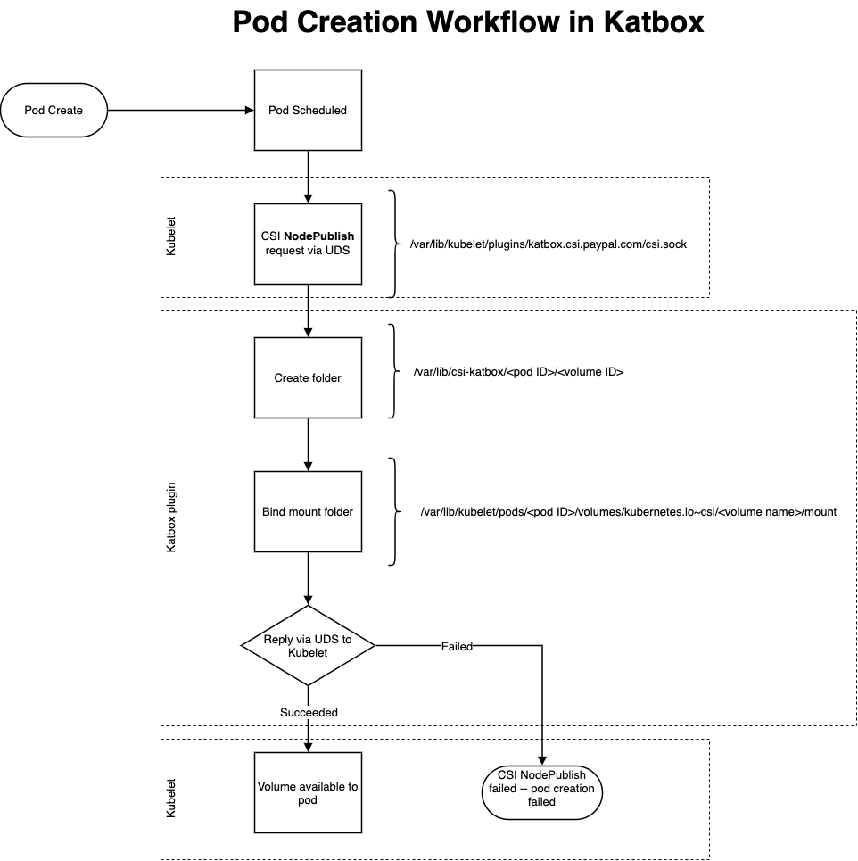
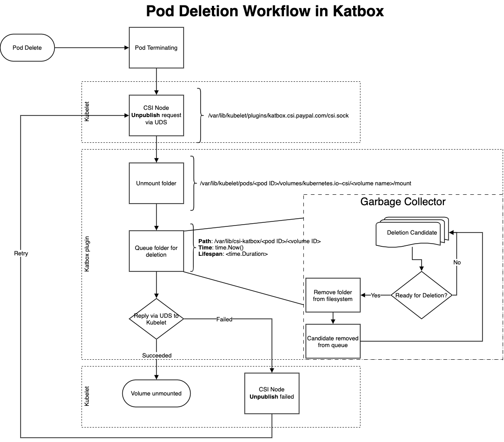

# Creation and Deletion of Volumes
## Volume Creation Flow


A request is made to the kubernetes to create a pod.  Kubernetes schedules a pod on a worker node in the cluster.

The kubelet sees that there is a request for an ephemeral-inline volume from the driver `katbox.csi.paypal.com` so it looks through its registered plugins and finds Katbox. It creates a `NodePublishVolume` api requests through the Unix Domain Socket registered for Katbox by the CSI Node Registrar.

Katbox receives the request and creates a folder in its working directory. By default, this directory is located at `/var/lib/csi-katbox`.

Using the information provided by the request, a new folder is created in the working directory using the volume ID received:
`$WORKDIR/<Volume ID>`

This newly created folder is then bind mounted to the mount location expected by the kubelet called the `targetPath`. By default this folder's location is in:
`/var/lib/kubelet/pods/<pod ID>/volumes/kubernetes.io-csi/<volume name>/mount`

The pod UUID is generated by Kubernetes when the pod is created, while the volume name is the name given to the mount in the spec.

Once the bind mount is successful, Katbox replies to the request as having succeeded.

If for any reason katbox is unable to fulfill the request, an error is returned to the kubelet and the pod creation process fails.

## Volume Deletion Flow


When a pod which uses a Katbox allocated volume is deleted, the kubelet sends a `NodeUnpublishVolume` api request to katbox via a previously registered Unix Domain Socket.

Katbox unbinds the folder that was bound from katbox's working directory to the `targetPath`.  Next, katbox adds the volume to its deletion queue and returns a successful deletion message to the kubelet. 

If for some reason katbox is unable to unmount the given folder, katbox will instead return an error to the kubelet which will then begin attempting to retry the deletion.

The information given to the deletion queue includes the path of the folder used for the volume inside katbox's working directory, the time at which it was deleted, as well as a lifespan.

An example of the information given to the queue looks like this:
```
{
    Path: "/var/lib/kubelet/csi-katbox/<pod ID>/<volume ID>",
    Time: time.Now(),
    Lifespan: <time.Duration,
}
```

The lifespan is set by the `--afterLifespan` flag passed to the katbox plugin. It determines how long after the deletion event we should hold on to the information stored inside folder whose volume was deleted. 

A goroutine is then responsible for looking through the deletion queue and determining if a deletion candidate has aged passed its afterlife span. If it has, the folder inside katbox's working directory is deleted at this time and the candidate is removed from the deletion queue. If the deletion candidate is _not_ yet eligible for deletion, the candidate remains in the queue.

The after lifespan is also influenced by a `pressureFactor` which is derived from the `--headroom` flag passed to the katbox plugin. The `pressureFactor` may decrease the age needed for an eviction to happen if the underlying storage being used by katbox is currently experiencing high utilization. 

High utilization in this case is defined by using the space defined by a value between 0.0 and 1.0 inclusive passed as the headroom flag.  The default value for headroom is `0.1`.  Therefore, the age required to be evicted will decrease if the underlying storage uses more than 90% of its total disk space.


