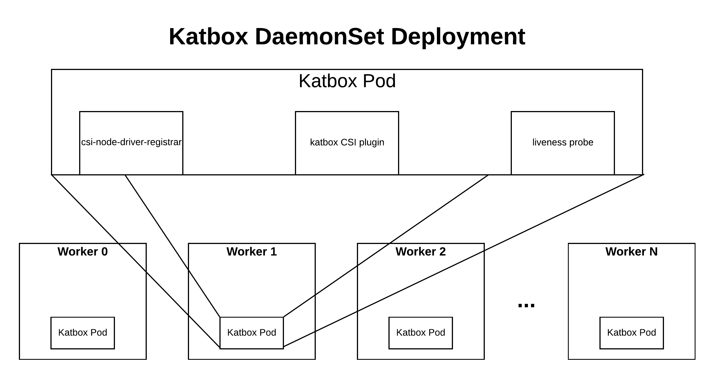
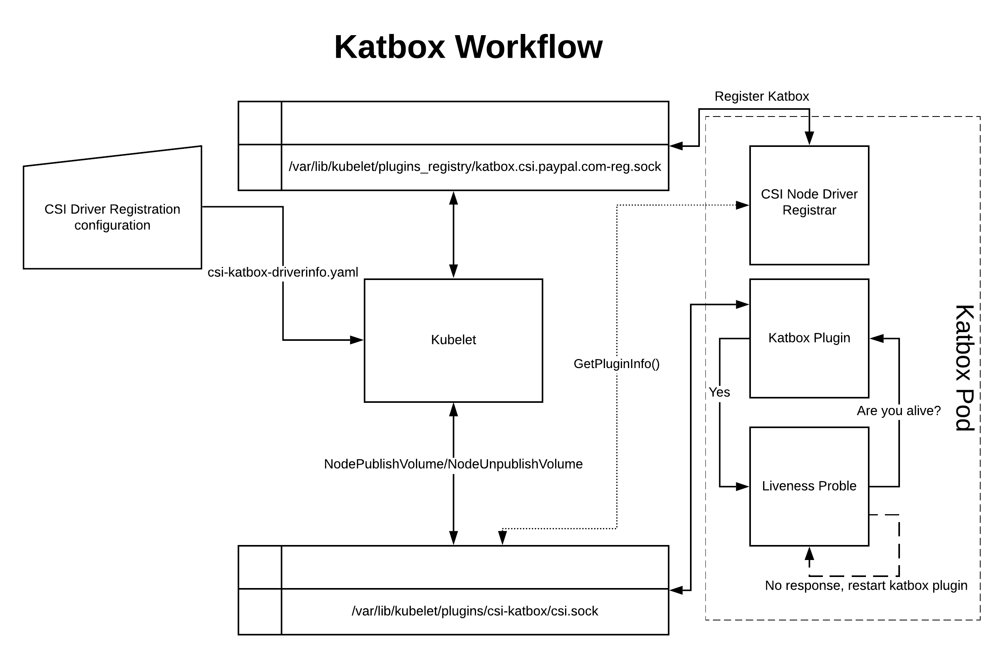

# Overview of how Katbox works
The Katbox pod is comprised of a CSI Node Driver, a Liveness probe, as well as a [CSI node driver registrar](https://github.com/kubernetes-csi/node-driver-registrar/).

Before bringing up the Katbox pod, we must register some information with Kubernetes so that Katbox is able to serve requests for ephemeral-inline volumes.

The `kubectl` command is used to tell Kubernetes about our CSI Driver's name, what type of volume lifecycles it supports (ephemeral only), and whether or not we need extra info provided to the CSI when a volume is being mounted (we do).

An example can be seen in[ csi-katbox-driverinfo.yaml](../deploy/latest/katbox/csi-katbox-driverinfo.yaml)

Since we want to be able to create Katbox containers in all worker nodes, we can deploy Katbox as a [DaemonSet](https://kubernetes.io/docs/concepts/workloads/controllers/daemonset/).

An example configuration can be seen in [csi-katbox-plugin.yaml](../deploy/latest/katbox/csi-katbox-plugin.yaml)

The CSI node driver registrar  comes up and registers Katbox by creating a Unix Domain Socket located at`/var/lib/kubelet/plugins_registry/katbox.csi.paypal.com-reg.sock`. The registrar is also responsible for querying the Katbox plugin, via a socket located at  `/var/lib/kubelet/plugins/csi-katbox/csi.sock` for information about the plugin using the `GetPluginInfo()` gRPC call. It uses this information provided by the CSI plugin while registering the node with the Kubelet.

If the registration is successful, the Katbox plugin will now be able to receive communication via `/var/lib/kubelet/plugins/csi-katbox/csi.sock` whenever an ephemeral volume from the driver `katbox.csi.paypal.com` is requested. This request will come in the form of a `NodePublishVolume` API call. When an ephemeral-inline volume previously allocated by Katbox needs to be deleted, a `NodeUnpublishVolume` API call will come through the same socket.

The [Liveness probe container](https://github.com/kubernetes-csi/livenessprobe), as its name implies, is responsible for sending HTTP health checks to the Katbox plugin. If the plugin does not reply to the heartbeat requests, the Liveness probe container signals the failure to the kubelet and the kubelet restarts the Katbox plugin container.